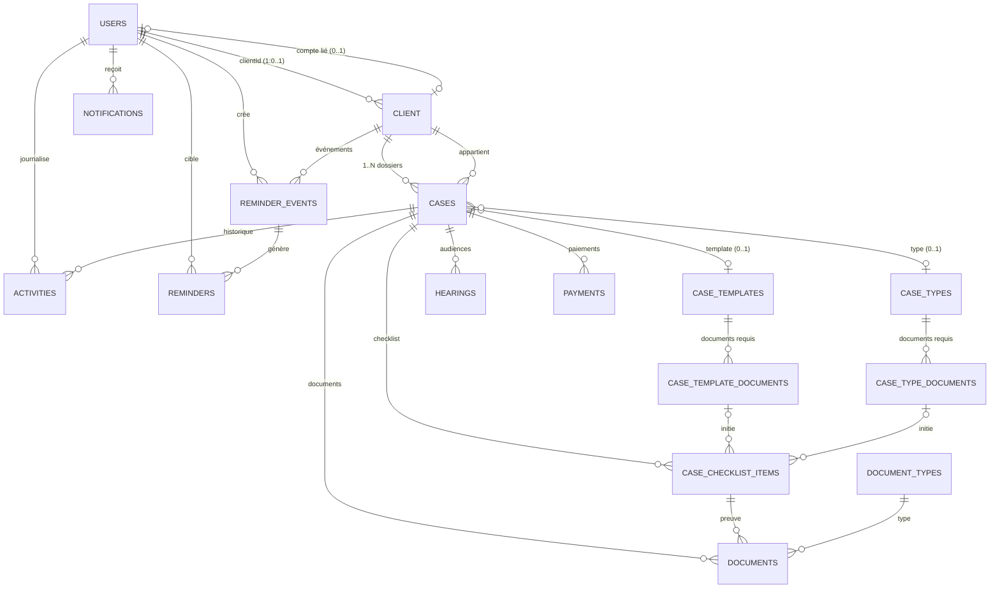
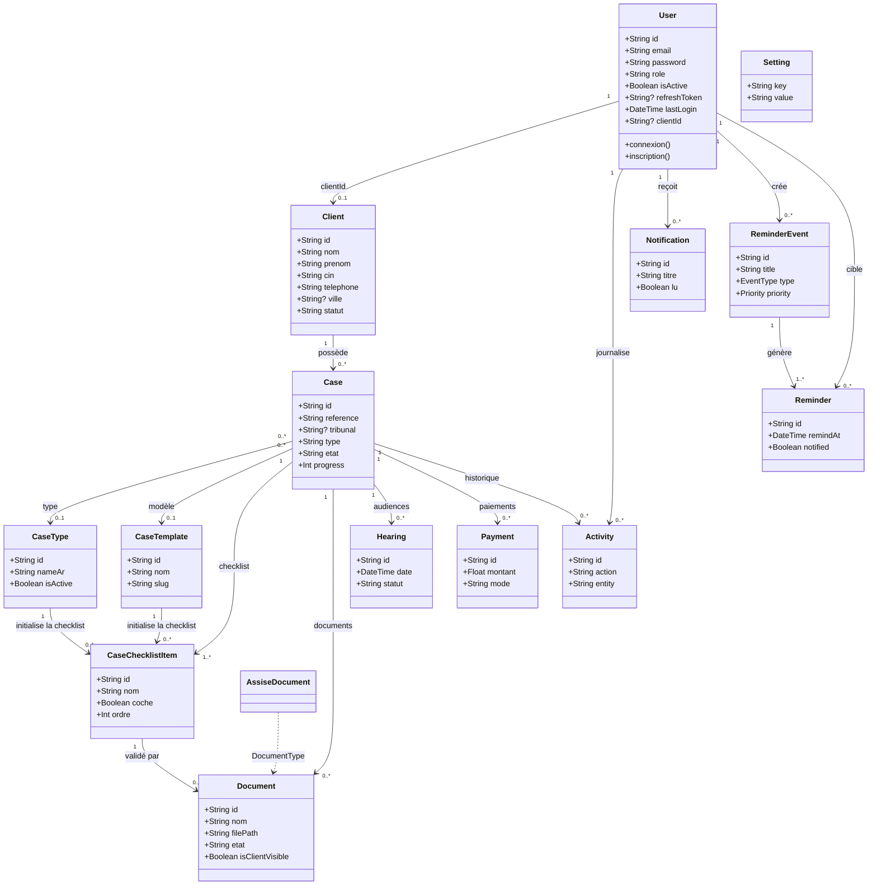
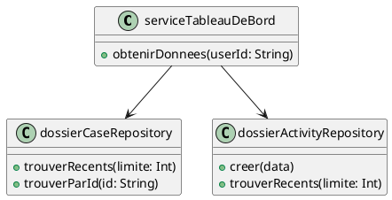
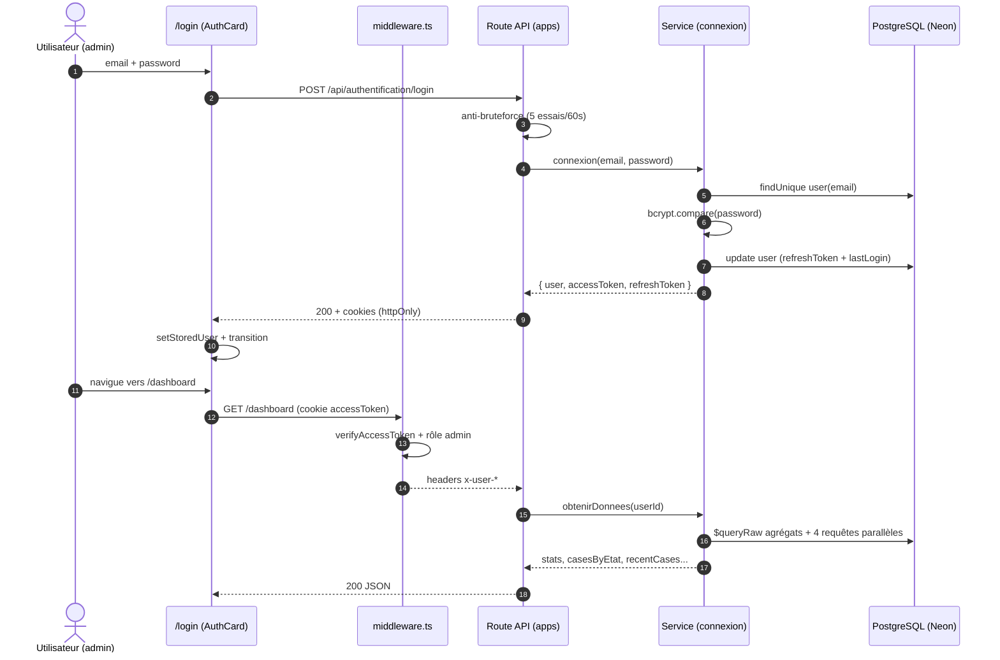
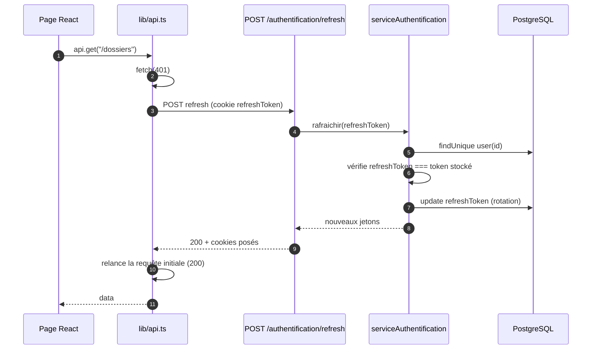
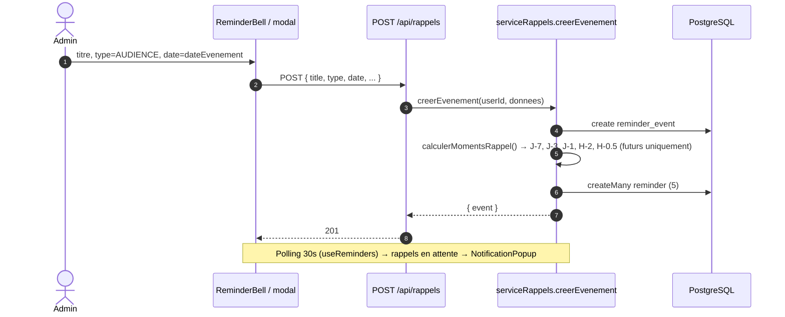
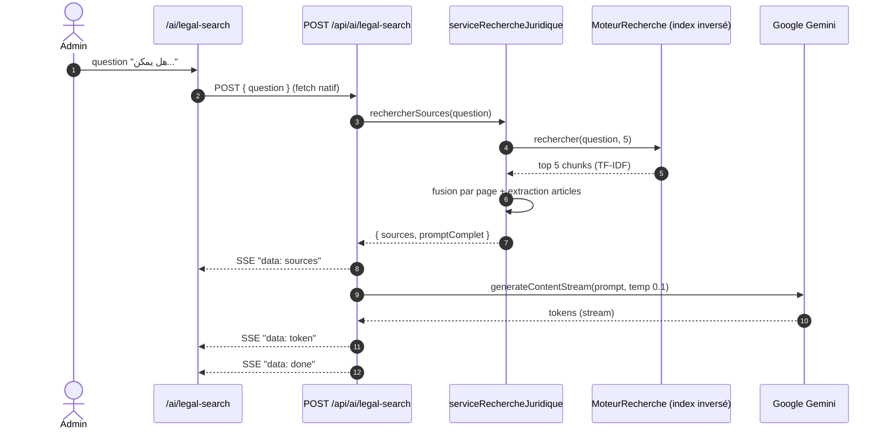

# DOCUMENTATION TECHNIQUE COMPLÈTE — ERP JURIDIQUE « MOUHAMI »

> **Projet :** `erp-juridique` — ERP pour cabinets d'avocats marocains
> **Stack :** Next.js 15 (App Router) · React 19 · TypeScript · Prisma 6 · PostgreSQL (Neon) · Tailwind CSS · Google Gemini AI
> **Langue du code :** français · **UI :** arabe (RTL) · **Code source :** `/home/mohamed/Téléchargements/mouhami`

---

## SOMMAIRE

1. [Vue d'ensemble](#1-vue-densemble)
2. [Arborescence du projet](#2-arborescence-du-projet)
3. [Architecture en couches](#3-architecture-en-couches)
4. [Détail des dossiers et fichiers](#4-détail-des-dossiers-et-fichiers)
   - 4.1 Fenêtre d'application `app/` (routes API + pages)
   - 4.2 Couches métier `fonctionnalites/`
   - 4.3 Infrastructure `infrastructure/`
   - 4.4 Frontend `components/`, `hooks/`, `lib/`, `types/`
   - 4.5 IA `ia/`
   - 4.6 Données `prisma/`, templates, uploads
5. [Base de données — tables et relations](#5-base-de-données--tables-et-relations)
6. [Journalisation des activités](#6-journalisation-des-activités)
7. [Sécurité et authentification](#7-sécurité-et-authentification)
8. [Moteur IA / RAG](#8-moteur-ia--rag)
9. [Variables d'environnement](#9-variables-denvironnement)
10. [Points d'attention](#10-points-dattention)
11. [Guide UML — diagrammes de classes, cas d'utilisation, séquence](#11-guide-uml--diagrammes)
    - 11.1 Méthodologie
    - 11.2 Diagramme de classes
    - 11.3 Diagramme de cas d'utilisation
    - 11.4 Diagrammes de séquence

---

## 1. VUE D'ENSEMBLE

« Mouhami » (المحامي = l'avocat) est une application **full-stack** de gestion de cabinet d'avocats :

- **Deux espaces :**
  - Espace **admin / cabinet** (sous `/app/(dashboard)/`) : dossiers, clients, audiences, documents, types de dossiers, rappels, recherche juridique IA, générateur de documents.
  - Espace **client** (sous `/app/(client)/`) : consultation des dossiers, documents visibles, profil.
- **Authentification :** JWT (accès + rafraîchissement) stockés en cookies `httpOnly`, rotation des refresh tokens, anti-bruteforce par IP.
- **IA :** Google Gemini (`gemini-2.5-flash`) utilisé pour la génération de documents juridiques DOCX et la recherche juridique RAG (index inversé TF-IDF sur une bibliothèque arabe).
- **Persistance :** PostgreSQL via Prisma, base hébergée sur **Neon** (serveur managé).

### 1.1 Scripts (package.json)

| Script | Commande |
|---|---|
| `npm run dev` | `next dev -p 3000` |
| `npm run build` | `next build` |
| `npm run start` | `next start` |
| `npm run lint` | `next lint` |
| `prisma:generate` / `postinstall` | `prisma generate` |
| `prisma:push` | `prisma db push` |
| `prisma:migrate` | `prisma migrate dev` |
| `prisma:seed` | `node --dns-result-order=ipv4first --import tsx prisma/seed.ts` |
| `prisma:studio` | `prisma studio` |

### 1.2 Dépendances principales

| Package | Usage |
|---|---|
| `next@15`, `react@19` | Framework App Router |
| `@prisma/client`, `prisma` v6 | ORM (moteur `library`, engineType) |
| `bcryptjs` | Hachage des mots de passe (12 tours) |
| `jsonwebtoken` | JWT accès/refresh |
| `@google/genai` | Client Gemini |
| `docx`, `adm-zip` | Génération / manipulation DOCX |
| `pdf-lib` + `fontkit` | Génération PDF (export dossier) |
| `lottie-react`, `framer-motion` | Animations UI |
| `lucide-react` | Icônes |

### 1.3 Configuration TypeScript

- Chemin d'alias `@/*` → racine du projet (utilisé partout).
- `strict: true`, module `esnext`, `moduleResolution: bundler`, `jsx: preserve`.

---

## 2. ARBORESCENCE DU PROJET

```
mouhami/
├── app/                        # App Router Next.js (routes API + pages)
│   ├── (client)/               # Espace client
│   ├── (dashboard)/            # Espace admin/cabinet
│   ├── api/                    # Routes API (47 fichiers)
│   ├── login/                  # Page de connexion animée
│   ├── globals.css             # Styles globaux (Tailwind + RTL)
│   ├── layout.tsx              # Layout racine (dir=rtl, lang=ar)
│   └── page.tsx                # Redirection vers /login
├── components/                 # Composants React réutilisables
│   ├── layout/                 # Header admin
│   ├── reminders/              # Rappels (cloche, popup, timer, modale)
│   ├── ui/                     # Composants UI génériques
│   └── lottie/                 # Animations Lottie (JSON + index + icones)
├── fonctionnalites/            # Couche métier (services + repositories)
│   ├── audiences/
│   ├── authentification/
│   ├── case-types/
│   ├── clients/
│   ├── dashboard/
│   ├── documents/
│   ├── dossiers/
│   ├── notifications/
│   ├── rappels/
│   └── recherche/
├── hooks/                      # Hooks React (état + données)
├── ia/                         # Intelligence artificielle
│   ├── fournisseurs/           # Contrat LLM + implémentation Gemini
│   ├── moteur-documents/       # Génération de documents
│   ├── prompts/                # Construction des prompts RAG
│   └── rag/                    # Moteur de recherche + service RAG
├── infrastructure/             # Socle technique
│   ├── base-de-donnees/        # Client Prisma, JWT, générateur de référence
│   ├── erreurs/                # Erreur métier + réponses API
│   ├── journalisation/         # Journal d'activités
│   ├── middleware/             # Vérification d'authentification
│   └── securite/               # Anti-bruteforce en mémoire
├── lib/                        # Utilitaires frontend
│   ├── assets/fonts/           # Polices arabes (DroidKufi)
│   ├── api.ts                  # Client fetch wrapper (refresh auto)
│   ├── auth.ts                 # Cookies utilisateur (localStorage)
│   ├── utils.ts                # Formatage (dates, statuts)
│   ├── utils/jwt.ts            # Vérification JWT (middleware)
│   ├── utils/pdf.ts            # Génération PDF dossier
│   └── transitionStore.ts      # Store transition login
├── prisma/
│   ├── schema.prisma           # 17 modèles + 2 enums
│   ├── seed.ts                 # Données initiales (admin)
│   └── migrations/             # 3 migrations SQL
├── types/                      # Types TS partagés frontend
├── public/images/              # Images statiques
├── uploads/                    # Fichiers documentaires uploadés
├── document_templates/         # Modèles JSON (méta) pour l'IA
├── legal_templates/            # Modèles DOCX/MD (plainte, etc.)
├── ai_data/                    # Stockage RAG (library.json, index.json)
├── docs/                       # Documentation d'audit existante
├── .env                        # Variables d'environnement
├── middleware.ts               # Middleware global Next.js
├── next.config.mjs / tailwind.config.ts / tsconfig.json / ...
```

---

## 3. ARCHITECTURE EN COUCHES

Le projet applique une **architecture en couches** stricte côté serveur :

```
Page React (app/) ──> Hook (hooks/) ──> lib/api.ts (fetch wrapper)
                                            │
┌────────────────── SERVEUR ─────────────────┐
│  middleware.ts (garde JWT + headers x-user-*)│
│  Route API (app/api/**/route.ts)             │
│       │  auth: exigerAuthentification/Admin   │
│       ▼                                       │
│  Service métier (fonctionnalites/*.service.ts)│
│       │                                       │
│       ▼                                       │
│  Repository Prisma (fonctionnalites/*.repository.ts)│
│       │                                       │
│       ▼                                       │
│  Client Prisma singleton (infrastructure/base-de-donnees/prisma.ts)│
│       │                                       │
│       ▼                                       │
│  PostgreSQL (Neon)                            │
└───────────────────────────────────────────────┘
```

**Principe :** les routes ne contiennent que le *glue code* HTTP (validation, cookies, codes de statut). La logique métier vit dans les **services**. L'accès aux données dans les **repositories** (unicité des requêtes Prisma, réutilisables). Les services journalisent chaque mutation via `infrastructure/journalisation/activite.repository.ts`.

---

## 4. DÉTAIL DES DOSSIERS ET FICHIERS

### 4.1 Fenêtre d'application — `app/`

#### Layouts racines

| Fichier | Rôle |
|---|---|
| `app/layout.tsx` | Layout racine : `<html lang="ar" dir="rtl">`, précharge `background.jpg`/`bgpages.png`, monte l'overlay global `<LoginTransitionAnimation />`. |
| `app/page.tsx` | Redirige vers `/login`. |
| `app/globals.css` | Tailwind, police « Cairo », styles RTL, scrollbars, keyframes (`fadeInUp`, `slideUp`…), classes `.animate-*`, `.hide-scrollbar`. |

#### Espace connexion — `app/login/`

| Fichier | Rôle |
|---|---|
| `page.tsx` | Page de connexion « cinématique » : animation Lottie plein écran, machine à états `intro → waiting → continuing → finished`, deux zones de clic (connexion/inscription), carte `AuthCard` révélée à un frame précis. |
| `lottieConfig.ts` | Config centralisée de l'animation : sources, frames (`PAUSE_FRAME=180`, `FORM_REVEAL_FRAME=230`, `FINAL_FRAME=324`), types `AuthMode`/`AnimationPhase`, mappage scène→écran. |
| `loading.tsx` | Skeleton de route (loading state). |

#### Espace admin — `app/(dashboard)/`

Layout : garde-fou `isAuthenticated()`/`isAdmin()` → redirections ; `<PageBackground />` + `<Header />` + `<main>`. **Pas de sidebar** : la navigation est une barre horizontale dans `components/layout/Header.tsx`.

| Page | Rôle / données | Hooks & endpoints |
|---|---|---|
| `dashboard/page.tsx` | Vue d'ensemble : hero + recherche globale, 4 `StatCircle`, `CountdownTimer`, `DataTable` derniers fichiers, création de rappel. | `useDashboard` (poll 30 s), `useReminders`, `GET /recherche?q=` |
| `clients/page.tsx` | Tableau clients (CIN, téléphone, statut, `_count.cases`), pagination, suppression. | `useClients` → `GET /clients` |
| `clients/new/page.tsx` | Formulaire d'ajout client → redirect `/clients/[id]`. | `createClient` → `POST /clients` |
| `clients/[id]/page.tsx` | Détail client + ses dossiers (`client.cases`), édition, suppression. | `fetchClient`, `deleteClient` |
| `clients/[id]/edit/page.tsx` | Édition client pré-remplie. | `fetchClient`, `updateClient` |
| `cases/page.tsx` | Liste des dossiers. La **modale de création** charge `Promise.all([/clients?limit=100, /modeles, /types-de-dossier?active=true])` à chaque ouverture. | `useCases`, `apiService` |
| `cases/new/page.tsx` | Redirection vers `/cases` (création via modale). | — |
| `cases/[id]/page.tsx` | Détail complet : progression/checklist (checkbox → `PATCH`), documents (+upload natif `fetch` FormData), audiences, activité, export PDF, édition. | `useCases` (toggleChecklist → re-fetch), `apiService` |
| `cases/[id]/edit/page.tsx` | Édition du dossier (type, sousType, tribunal, mahakimRef, état, description, notes). | `fetchCase`, `updateCase` |
| `audiences/page.tsx` | Liste des audiences (lecture seule). | `apiService: GET /audiences` |
| `case-types/page.tsx` | CRUD types de dossier + documents obligatoires (2 modales), refetch après chaque action. | `useCaseTypes` |
| `documents/page.tsx` | **Gestion documentaire centrale.** ⚠️ **N+1 documenté** : `GET /dossiers?limit=20` puis `GET /dossiers/{id}/documents` par dossier, agrégation, top 50. | `apiService` |
| `documents/types/page.tsx` | CRUD types de documents (nom, slug). | `apiService` |
| `ai/page.tsx` | Page porte « منشئ المستندات » → CTA vers `/ai/generator`. | — |
| `ai/generator/page.tsx` | Générateur : choix du modèle → `GET /ai/templates/[type]` → saisie des champs → `POST /ai/generate` → téléchargement DOCX (base64→Blob). | `apiService` |
| `ai/legal-search/page.tsx` | Recherche RAG : `fetch` natif SSE vers `POST /api/ai/legal-search`, lecture du stream (`data:`), sources/articles, cumul des tokens, bouton d'abandon (AbortController). | `fetch` + états locaux |
| `settings/page.tsx` | Paramètres cabinet (5 champs `cabinet_*`). | `GET/PUT /settings` |

Fichiers transverses : `layout.tsx`, `loading.tsx`, `error.tsx`.

#### Espace client — `app/(client)/`

| Fichier | Rôle |
|---|---|
| `layout.tsx` | Garde-fou (non connecté → `/login`, admin → `/dashboard`), header minimal (logo, nom, déconnexion). |
| `client/dashboard/page.tsx` | Liste des dossiers du client (`GET /dossiers?limit=50`). ⚠️ voir §10.2 (contrainte middleware). |
| `client/cases/[id]/page.tsx` | Détail dossier (lecture seule) ; **filtre front** sur les documents `isClientVisible` ; téléchargement. |
| `client/profile/page.tsx` | Profil client : `GET /clients/me`, `PUT /clients/me` (téléphone, adresse, ville). |
| `loading.tsx`, `error.tsx` | États de chargement/erreur. |

#### Routes API — `app/api/` (47 fichiers)

**Permissions** (vérifiées dans chaque route) :
- **Publique** : `/api/authentification/login`, `/register`, `/refresh`, `/api/health`.
- **Requiert auth** : `exigerAuthentification(request)`.
- **Requiert admin** : `exigerAdmin(request)`.

| Chemin | Méthodes | Permission | Rôle |
|---|---|---|---|
| `/api/activites` | GET | auth | Dernières activités (`?limit=20`) |
| `/api/activites/cases/[casId]/activities` | GET | auth | Activités d'un dossier |
| `/api/ai/generate` | POST | auth | Génère un DOCX juridique (template + champs) → `{ text, docxBase64, fileName }` |
| `/api/ai/legal-search` | POST | auth | Recherche RAG + réponse Gemini **en streaming SSE** (`sources`, `token`, `answer`, `done`, `error`) |
| `/api/ai/templates/[type]` | GET | auth | Renvoie le JSON de `document_templates/{type}.json` |
| `/api/audiences` | GET | auth | Liste paginée des audiences |
| `/api/audiences/[id]` | PUT/DELETE | admin | MàJ / suppression audience (+ journalisation) |
| `/api/authentification/login` | POST | **publique** | Connexion + cookies (voir §7) |
| `/api/authentification/register` | POST | **publique** | Inscription (rôle admin) + cookies |
| `/api/authentification/refresh` | POST | **publique** | Rotation des jetons (cookie `refreshToken` ou body) |
| `/api/authentification/me` | GET | auth | Profil courant (select non-sensible) |
| `/api/authentification/logout` | POST | auth | Invalidation du refresh token + suppression cookies |
| `/api/clients` | GET/POST | GET auth · POST admin | Liste paginée + recherche / création |
| `/api/clients/[id]` | GET/PUT/DELETE | GET auth · PUT/DELETE admin | Détail / MàJ / suppression (journalisé) |
| `/api/clients/me` | GET/PUT | auth | Client lié à l'utilisateur courant ; `PUT` restreint à téléphone/adresse/ville |
| `/api/documents/[id]` | GET/PUT/DELETE | GET auth · PUT/DELETE admin | Détail / MàJ / suppression métadonnées (+ suppression fichier) |
| `/api/documents/[id]/download` | GET | auth | Télécharge le fichier disque (`Content-Disposition: attachment`) |
| `/api/document-types` | GET/POST | GET auth · POST admin | Liste / création types de documents |
| `/api/document-types/[id]` | PUT/DELETE | admin | MàJ / suppression type de document |
| `/api/dossiers` | GET/POST | GET auth · POST admin | Liste paginée (filtres search/etat/type/clientId) / création |
| `/api/dossiers/[id]` | GET/PUT/DELETE | GET auth · PUT/DELETE admin | Détail complet / MàJ / suppression (journalisé) |
| `/api/dossiers/[id]/pdf` | GET | auth | Export PDF du dossier (`lib/utils/pdf.ts`) |
| `/api/dossiers/[id]/hearings` | GET/POST | GET auth · POST admin | Audiences d'un dossier / création |
| `/api/dossiers/[id]/payments` | GET/POST | GET auth · POST admin | Paiements / création (journ. `payment`) |
| `/api/dossiers/[id]/documents` | GET/POST | GET auth · POST admin | Documents du dossier / **upload multipart** (sauvegarde dans `uploads/`) |
| `/api/dossiers/[id]/checklist/[itemId]` | PATCH | admin | Coche/décoche checklist → `{ progress }` |
| `/api/health` | GET | **publique** | Sonde `{ status:"ok" }` |
| `/api/modeles` | GET | auth | Liste des modèles de dossier (**select id+nom**) |
| `/api/modeles/[id]` | GET | auth | Détail du modèle + documents ordonnés |
| `/api/notifications` | GET | auth | Notifications + compte non-lues (`Promise.all`) |
| `/api/notifications/read-all` | PUT | auth | Marquer tout lu |
| `/api/notifications/[id]/read` | PUT | auth | Marquer une notification lue |
| `/api/paiements/[id]` | DELETE | admin | Suppression d'un paiement |
| `/api/rappels` | POST | auth | Création d'événement + génération des 5 rappels |
| `/api/rappels/[id]` | PUT/DELETE | auth | MàJ / suppression (recrée les rappels si date/heure change) |
| `/api/rappels/today` | GET | auth | Événements du jour |
| `/api/rappels/pending` | GET | auth | Rappels en attente (non notifiés, non ignorés, échus) |
| `/api/rappels/pending/count` | GET | auth | Nombre de rappels en attente |
| `/api/rappels/next` | GET | auth | Prochain événement (ou `null`) |
| `/api/rappels/[id]/dismiss` | POST | auth | Ignorer un rappel |
| `/api/recherche` | GET | auth | **Recherche globale** multi-entités (`?q=`, `?limit=`) |
| `/api/settings` | GET/PUT | GET auth · PUT admin | Lecture map key→value / upsert |
| `/api/tableau-de-bord` | GET | auth | Agrégats dashboard (requête SQL raw + 4 parallèles) |
| `/api/types-de-dossier` | GET/POST | GET auth · POST admin | Liste (`?active=true`) / création type de dossier |
| `/api/types-de-dossier/[id]` | GET/PUT/DELETE | GET auth · PUT/DELETE admin | Détail / MàJ / suppression |
| `/api/types-de-dossier/[id]/documents` | GET/POST | GET auth · POST admin | Documents obligatoires / ajout |
| `/api/types-de-dossier/[id]/documents/[docId]` | PUT/DELETE | admin | MàJ / suppression document obligatoire |

---

### 4.2 Couches métier — `fonctionnalites/`

Chaque module suit le modèle **service** + **repository** (certains modules sont « repository-only »).

#### `authentification/`

| Fichier | Exports & rôles |
|---|---|
| `authentification.service.ts` | `serviceAuthentification` : `connexion` (vérif email/actif/bcrypt → tokens → `mettreAJourConnexion`), `inscription` (rôle `admin`, bcrypt 12 tours), `rafraichir` (**rotation** : le refresh token doit matcher celui en base), `deconnexion` (refreshToken→null), `inscrireClient` (transaction User+Client+liaison). |
| `authentification.repository.ts` | `dossierUtilisateurRepository` : `trouverParEmail`, `trouverParId`, `trouverProfilParId` (select sans password/refreshToken), `creer`, `mettreAJourJetonRafraichissement`, `mettreAJourConnexion` (refreshToken + lastLogin en 1 requête), `mettreAJourMotDePasse`. |

#### `clients/`

| Fichier | Exports & rôles |
|---|---|
| `client.service.ts` | `serviceClients` : `trouverTous` (pagination + recherche), `trouverParId`, `creer` (liaison userId optionnelle), `mettreAJour`, `supprimer`, `trouverParUserId`, `mettreAJourPropre` (**contrôle d'autorisation** : `utilisateur.clientId === id`, champs limités téléphone/adresse/ville), `statistiques`. Toutes les mutations appellent `dossierActiviteRepository.creer`. |
| `client.repository.ts` | `dossierClientRepository` : `trouverTous` (recherche multi-champs `insensitive`, `_count.cases`, findMany+count **en parallèle**), `trouverParId` (inclut `cases` avec `_count` documents/audiences), `creer`, `mettreAJour`, `supprimer`, `trouverParUserId`, `compter`. |

#### `dossiers/`

| Fichier | Exports & rôles |
|---|---|
| `index.ts` | Ré-exporte `serviceDossiers` et `dossierCaseRepository` (baril). |
| `case.service.ts` | `serviceDossiers` : `trouverTous` (filtres), `trouverParId` (détail complet), `creer` (**transaction** : référence + dossier + checklist initialisée depuis `templateId` ou `caseTypeId`, journalisation), `mettreAJour` (nettoie champs vides `""→undefined`), `supprimer` (journalisé), `basculerChecklist` (recalcul `progress` = items obligatoires cochés / total × 100), `statistiques`, `obtenirDonneesExport` (dates ISO pour PDF). |
| `case.repository.ts` | `dossierCaseRepository` : `trouverTous` (recherche + filtres, includes client + `_count`), `trouverRecents(limite)` (findMany sans count), `trouverParId` (client, template+documents, documents+type, checklist triée, audiences, paiements, 20 activités), `creer`, `mettreAJour`, `supprimer`, `compter`, `compterParEtat` (`groupBy` → `Record<etat, nombre>`). |

#### `documents/`

| Fichier | Exports & rôles |
|---|---|
| `index.ts` | Ré-exporte `serviceDocuments`, `dossierDocumentRepository`. |
| `document.service.ts` | `serviceDocuments` : `telecharger` (création + **coche automatique** du `checklistItemId` + recalcule progression), `trouverParCasId`, `trouverParId`, `mettreAJour`, `supprimer` (**supprime le fichier physique** `fs.unlinkSync` puis la ligne), `trouverTousTypes`, `creerType` (unicité slug), `mettreAJourType`, `supprimerType`, `statistiques`. Répertoire : `UPLOAD_DIR || "./uploads"`. |
| `document.repository.ts` | `dossierDocumentRepository` : CRUD `document` + CRUD `documentType` ; `compter`, `compterEnAttente`, `trouverTypeParSlug`. |

#### `audiences/`

| Fichier | Exports & rôles |
|---|---|
| `index.ts` | Ré-exporte `dossierAudienceRepository`. |
| `audience.repository.ts` | `dossierAudienceRepository` : `trouverTous` (pagination, inclut cas+référence+client), `trouverParCasId`, `trouverParId`, `creer`, `mettreAJour`, `supprimer`, `compterProchaines`, `trouverProchaines` (`date >= now`, `statut="planifiee"`, tri ASC). **Pas de service dédié.** |

#### `case-types/`

| Fichier | Exports & rôles |
|---|---|
| `type-cas.repository.ts` | `dossierTypeCasRepository` : CRUD `caseType` (option `seulementActifs`, inclut `documents` ordonnés + `_count.cases`) + CRUD `caseTypeDocument` (documents obligatoires). Sert à initialiser la checklist à la création d'un dossier. |

#### `notifications/`

| Fichier | Exports & rôles |
|---|---|
| `notification.repository.ts` | `dossierNotificationRepository` : `trouverParUserId`, `compterNonLues`, `marquerCommeLue`, `marquerToutesCommeLues`, `creer`, `supprimerAnciennes` (**purge > 30 jours**). **Pas de service dédié.** |

#### `rappels/`

| Fichier | Exports & rôles |
|---|---|
| `index.ts` | Ré-exporte `serviceRappels`, `dossierRappelRepository`. |
| `rappel.service.ts` | `serviceRappels` : `creerEvenement` (**génère 5 rappels** : J-7, J-3, J-1, H-2, H-0.5 — uniquement si dans le futur), `mettreAJourEvenement` (vérifie l'appartenance ; si date/heure change → supprime + recrée les rappels), `supprimerEvenement`, `obtenirProchainEvenement`, `obtenirEvenementsAujourdhui`, `obtenirRappelsEnAttente`, `obtenirCompteEnAttente`, `ignorerRappel`, `marquerNotifie`. |
| `rappel.repository.ts` | `dossierRappelRepository` : CRUD `reminderEvent` + `reminder` ; `creerRappels` (`createMany`), `trouverRappelsEnAttente` (non notifié + non ignoré + échu, inclut l'événement/client/cas), `supprimerEvenement` (supprime d'abord les `reminder` liés), `supprimerRappelsParEvenement`. |

#### `recherche/`

| Fichier | Exports & rôles |
|---|---|
| `recherche.service.ts` | `serviceRecherche.rechercher(requete, limite=20)` : **4 recherches en parallèle** (`Promise.all`) sur clients (nom, prénom, CIN, tel, email, ville, profession), dossiers (référence, mahakimRef, tribunal, type, sousType, description, notes, nom/prénom client, nameAr caseType), documents (nom, description, fileName, auteur, commentaires), types de dossier (nameAr, description). **`select` réduits** sur chaque entité (champs affichés uniquement). `< 2 caractères` → tableaux vides. |

#### `dashboard/`

| Fichier | Exports & rôles |
|---|---|
| `dashboard.service.ts` | `serviceTableauDeBord.obtenirDonnees(userId)` : **agrégats en 1 requête SQL raw** `$queryRaw` (`nb_clients`, `nb_cases`, `nb_documents_attente`, `nb_audiences`, `cases_par_etat` via `jsonb_object_agg`) + **4 requêtes parallèles** (activités récentes 10, dossiers récents 5, audiences à venir 5, notifications non lues). Retourne `{ statistiques, casesParEtat, activitesRecentes, casesRecentes, audiencesProchaines, notifications }`. |

---

### 4.3 Infrastructure — `infrastructure/`

| Fichier | Rôle |
|---|---|
| `base-de-donnees/prisma.ts` | **Client Prisma singleton** (évite les fuites en dev via `globalThis`). Applique `connection_limit=4` par défaut à l'URL (overridable `PRISMA_CONNECTION_LIMIT`) pour ne pas saturer le pooler Neon. `ensureDbConnected()` : ping `SELECT 1` avec un retry après 3 s. Logs : `error` en prod, `error+warn` en dev. |
| `base-de-donnees/jeton.ts` | JWT : `genererJetonAcces` (15 min défaut), `genererJetonRafraichissement` (7 j), `verifier*`. **Rejette les secrets placeholder en production** (lève une erreur). Secrets séparés accès/refresh. |
| `base-de-donnees/reference.ts` | `genererReferenceDossier()` → `REF-AAAAnnée-XXXX` (aléatoire 4 chiffres). |
| `erreurs/erreur-api.ts` | Classe `ErreurApi` (code HTTP + code métier + détails) avec usines : `nonTrouve` (404), `autorisationRefusee` (403), `nonAuthentifie` (401), `donneesInvalides` (400), `conflit` (409) ; `toJSON()` normalise `{ success:false, error:{...} }`. |
| `erreurs/reponse-api.ts` | `reponseSucces(data)` → `{ success:true, ...data }` ; `reponseErreur(err)` → sérialise `ErreurApi`, sinon 500 générique (`ERREUR_INTERNE` / `DEMANDE_INVALIDE`), log console en dev. |
| `journalisation/activite.repository.ts` | `dossierActiviteRepository` : `creer` (userId, action, entity, entityId, description, metadata, casId), `trouverRecents`, `trouverParCasId`, `trouverParUserId`. |
| `middleware/authentification.ts` | `obtenirUtilisateur(request)` : accepte `Authorization: Bearer`, les **headers `x-user-*`** posés par `middleware.ts`, ou le cookie `accessToken`. `exigerAuthentification` → 401 (throw `NextResponse.json`) ; `exigerAdmin` → +403. |
| `securite/anti-bruteforce.ts` | `verifierTentatives(clé, {fenetreMs, tentativesMax})` : compteur en mémoire par clé, fenêtre glissante, purge auto au-delà de 10 000 entrées ; retourne `{ autorise, restant, reinitialisation }`. Utilisé par login/register (5 tentatives / 60 s par IP → 429). |

---

### 4.4 Frontend — `components/`, `hooks/`, `lib/`, `types/`

#### `hooks/`

| Hook | État / API | Endpoints |
|---|---|---|
| `useAuth` | `user`, `loading` ; `login`, `register`, `logout`, `isAuthenticated`, `isAdmin`. Login → cookies + store user + transition. | `/authentification/*` (`requireAuth:false`) |
| `useCases` | `cases`, `caseData`, `pagination`, `loading`, `error` ; CRUD + `toggleChecklist` + `exportPDF`. Pas de polling. | `/dossiers*` |
| `useCaseTypes` | `types`, `loading`, `error` ; CRUD types + documents obligatoires. | `/types-de-dossier*` |
| `useClients` | `clients`, `client`, `pagination`, `loading`, `error` ; CRUD. | `/clients*` |
| `useDashboard` | `data` (DashboardData), `loading`, `error` ; `refresh`. **Polling 30 s.** | `/tableau-de-bord` |
| `useReminders` | Store **global** (`useSyncExternalStore`) : `nextEvent`, `todayEvents`, `pendingReminders`, `pendingCount`, `timerNotifications` ; `refetch`, `createEvent`, `updateEvent`, `deleteEvent`, `dismissReminder`, `addTimerNotification` ; `urgent` = prochain événement < 24 h. **Polling 30 s** activé au 1ᵉʳ souscripteur. | `Promise.all` de `/rappels/next|today|pending|pending/count` |

#### `components/`

| Composant | Rôle |
|---|---|
| `layout/Header.tsx` | Barre de navigation admin (7 items, `usePathname` pour l'actif), logo Lottie, `ReminderBell`, menu utilisateur (documents, paramètres, déconnexion). |
| `reminders/CountdownTimer.tsx` | Décompte (1 s) vers le prochain événement, `onFinish` déclenché une fois. |
| `reminders/CreateReminderModal.tsx` | Modale de création d'événement (type, priorité, date, heure, lieu). |
| `reminders/NotificationPopup.tsx` | Toasts (8 s) des rappels en attente, file d'attente dédupliquée, notification web, boutons « عرض الملف ». |
| `reminders/ReminderBell.tsx` | Cloche à badge, panneau déroulant, demande de permission de notification. |
| `ui/AuthCard.tsx` | Carte login/register (formulaires, affichage mdp). |
| `ui/Badge.tsx` | Pastille colorée via `getStatusColor(text)`. |
| `ui/DataTable.tsx` | Tableau générique (`columns: {key,label,render?}[]`), états vide/chargement. |
| `ui/IconeAnimee.tsx` | Wrapper Lottie (replit au hover/click, posé sur dernière frame). |
| `ui/LoginTransitionAnimation.tsx` | Overlay plein écran (z-9999) piloté par `transitionStore`. |
| `ui/LogoMouhami.tsx` | Logo Lottie statique, rejoue au hover. |
| `ui/Modal.tsx` | Modale générique (`size=sm|md|lg`), bloque le scroll du body. |
| `ui/PageBackground.tsx` | Fond fixe `bgpages.png`. |
| `ui/Pagination.tsx` | Pagination compacte avec ellipses. |
| `ui/StatCard.tsx` | Carte stat avec compteur animé (IntersectionObserver). *Non utilisé par les pages actuelles.* |
| `ui/StatCircle.tsx` | Anneau SVG progressif + compteur animé (utilisé par le dashboard). |
| `lottie/index.ts` | Exporte les 14 animations Lottie nommées. |
| `lottie/icones.ts` | **Catalogue centralisé** rôle↔icône (`icones`, `tailles`) — point d'import obligatoire. |

#### `lib/`

| Fichier | Rôle |
|---|---|
| `api.ts` | Wrapper `fetch` (`API_BASE="/api"`). **Rafraîchit automatiquement** le token sur 401 (POST `/authentification/refresh`, nouvelle tentative), redirige vers `/login` si échec. Expose `api` + `apiService` (`get/post/put/patch/delete/upload`). |
| `auth.ts` | Gestion côté navigateur du cookie `user` (JSON) : `isAuthenticated`, `getStoredUser`, `setStoredUser`, `clearAuth`, `isAdmin`. |
| `utils/jwt.ts` | `verifyAccessToken` pour le `middleware.ts` (secret `JWT_SECRET`, rejette les placeholders en prod). |
| `utils.ts` | `formatDateShort` (ar-MA), `formatCaseStatus` (en_cours/cloture/suspendu), `formatDocStatus`, `getStatusColor`. |
| `utils/pdf.ts` | `generateCasePDF(data)` avec `pdf-lib` + `fontkit`, police **DroidKufi** embarquée, pages : garde/description/documents table/audiences/pagination `- n -`. |
| `transitionStore.ts` | Mini-store `isActive/start/finish/subscribe` : garde l'overlay de transition visible jusqu'au chargement du dashboard. |

#### `types/`

`types/index.ts` définit les types TS partagés : `User`, `Client`, `Case`, `CaseTemplate(+Document)`, `CaseChecklistItem`, `DocumentType`, `CaseType(+Document)`, `Document`, `Hearing`, `Notification`, `Activity`, `Payment`, `EventType`, `Priority`, `ReminderEvent`, `Reminder`, `SearchResult`, `DashboardData`.

---

### 4.5 IA — `ia/`

#### `fournisseurs/` (couche LLM)

| Fichier | Rôle |
|---|---|
| `llm-provider.ts` | **Interface** `FournisseurLLM` : `genererTexte(prompt, options?)`, `estDisponible()` ; type `OptionsGeneration` (temperature, modele, maxTokens). |
| `gemini-provider.ts` | `FournisseurGemini` (singleton `fournisseurGemini`) : SDK `@google/genai`, modèle `GEMINI_MODEL` (défaut `gemini-2.5-flash`), température 0.3, client init en lazy. |

#### `moteur-documents/` (génération DOCX)

| Fichier | Rôle |
|---|---|
| `chargeur-modele.ts` | `ChargeurModele` : charge les **métadonnées** (`document_templates/{type}.json`) et le **contenu** (`legal_templates/{type}/reference.docs` > `template.md`), ou le DOCX natif (`reference.docx`) ; `remplirModele` (remplace `{{CLE}}`), `modeleExiste`. |
| `moteur-modele-docx.ts` | `MoteurModeleDocx` : remplace les placeholders dans un **DOCX natif** (ZIP via `adm-zip`, traite `word/document.xml`, headers/footers). **Fusionne les placeholders coupés par Word** en plusieurs `<w:t>`. |
| `constructeur-docx.ts` | `ConstructeurDocx` : convertit le Markdown interne rempli en **DOCX** (bibliothèque `docx`) — police **Tajawal**, RTL, alignement droite, titre centré, séparateurs. |
| `generateur-document.ts` | `GenerateurDocument.generer(typeModele, champs)` : orchestre tout (mappage champs camelCase→UPPER, valeurs statiques, arbitrage **DOCX natif ↔ texte**, retourne `{ docxBase64, nomFichier, apercu }`). |

#### `prompts/` + `rag/`

| Fichier | Rôle |
|---|---|
| `construction-contexte.ts` | `ConstructeurPrompt` : prompt **système** (assistant juridique marocain, ne pas inventer, citer les textes) + prompt **utilisateur** (question + sources numérotées avec page). |
| `rag/moteur-recherche.ts` | `MoteurRechercheVectorielle` : **index inversé TF-IDF** persistant (`ai_data/legal_search/library.json` + `index.json`), tokenisation arabe normalisée (alef/ta marbuta/kashida, préfixe « ال »), mots d'arrêt arabes, scoring normalisé, **cache mémoire invalidé par signature (mtime+size)**. |
| `rag/service-recherche-juridique.ts` | `ServiceRechercheJuridique` : `rechercherSources(question)` → top 5 chunks → **fusion par page** (garde le plus long) → **extraction des articles juridiques** (الكتاب/القسم/الباب/الفرع/المادة/الفصل avec contexte hiérarchique) → prompt complet. `genererReponse` → Gemini (température 0.1). |

---

### 4.6 Données — `prisma/`, templates, uploads

| Élément | Rôle |
|---|---|
| `prisma/schema.prisma` | 17 modèles + 2 enums (voir §5). Base PostgreSQL, moteur `library`. |
| `prisma/seed.ts` | Crée le compte admin (`admin@cabinet.ma` / `admin123`, hash bcrypt), quelques types/templates de référence. |
| `prisma/migrations/` | 3 migrations (`init`, `add_case_types`, `add_reminder_models`). |
| `document_templates/*.json` | Métadonnées des 6 modèles IA : `appeal`, `contract`, `memorandum_introductif`, `plainte`, `procuration`, `summons` (type, nomAr, champs...). |
| `legal_templates/plainte/` | Template DOCX + `.docs` + `template.md` (modèle de plainte). |
| `uploads/` | Fichiers documentaires uploadés (chemin stocké dans `documents.filePath`). |
| `ai_data/legal_search/` | Bibliothèque RAG (JSON) — alimentée par ingestion. |
| `public/images/` | `background.jpg`, `bgpages.png`, `logo.png`. |
| `docs/` + `audit*.md` | Audit architectural et documentation de conception existante. |

---

## 5. BASE DE DONNÉES — TABLES ET RELATIONS

**17 tables** (nom physique via `@@map`), hébergées sur PostgreSQL **Neon**. Tous les IDs sont des **UUID** (`@db.Uuid`). Le client Prisma est généré avec `engineType = "library"`.

### 5.1 Dictionnaire des tables

| Modèle (Prisma) | Table | Description |
|---|---|---|
| `User` | `users` | Compte système : email unique, password (bcrypt), nom/prénom, téléphone, `role` (`admin`/`client`), `isActive`, `refreshToken`, `lastLogin`, `clientId` (optionnel, unique). |
| `Client` | `clients` | Client du cabinet (personne physique) : nom, prénom, CIN unique, téléphone, adresse, ville, profession, photo, email, `statut` (défaut `actif`), observations. |
| `Case` | `cases` | Dossier juridique : `reference` unique (REF-AAAA-XXXX), `mahakimRef`, tribunal, `type`, `sousType`, `dateCreation`, `etat` (`en_cours` défaut), `progress` (0–100), description, notes. |
| `CaseType` | `case_types` | Type de dossier (ex : droit de la famille) : `nameAr`, description, `isActive`. |
| `CaseTypeDocument` | `case_type_documents` | Document obligatoire **par type** : `nameAr`, `isRequired`, `order`. |
| `CaseTemplate` | `case_templates` | Modèle de dossier : `nom`, `slug` unique, description. |
| `CaseTemplateDocument` | `case_template_documents` | Document obligatoire **par modèle** : `nom`, `obligatoire`, `ordre`. |
| `CaseChecklistItem` | `case_checklist_items` | Item de checklist **instancié par dossier** : `nom`, `obligatoire`, `ordre`, `coche`. |
| `DocumentType` | `document_types` | Type de document (nom, slug unique, icon). |
| `Document` | `documents` | Document du dossier : nom, description, `fileName`/`filePath`, `fileSize`, auteur, `etat` (`en_attente` défaut), commentaires, `isClientVisible`. |
| `Hearing` | `hearings` | Audience : date, heure, type, tribunal, salle, juge, `statut` (défaut `planifiee`), notes. |
| `Notification` | `notifications` | Notification utilisateur : titre, message, `type`, `lu`, `referenceType`/`referenceId`. |
| `Activity` | `activities` | Journal d'activités : `action`, `entity`, `entityId`, description, `metadata` (Json), `casId` optionnel. |
| `Payment` | `payments` | Paiement du dossier : `montant` (Float), date, mode, référence, notes. |
| `ReminderEvent` | `reminder_events` | Événement (RDV, audience, tâche, échéance) : titre, description, `type` (enum), date/heure, lieu, `priority` (enum), `clientId`/`caseId` optionnels. |
| `Reminder` | `reminders` | Rappel ponctuel lié à un événement : `remindAt`, `notified`, `dismissed`. |
| `Setting` | `settings` | Paramètres clé/valeur (`key` unique). |

**Enums** (Prisma → type PostgreSQL `enum`) :
- `EventType` : `RENDEZ_VOUS`, `AUDIENCE`, `TACHE`, `ECHEANCE`
- `Priority` : `FAIBLE`, `NORMALE`, `IMPORTANTE`, `URGENTE`

### 5.2 Détail des colonnes (tables clés)

**`users`**
`id` UUID PK · `email` TEXT UNIQUE · `password` TEXT · `nom` TEXT · `prenom` TEXT · `telephone` TEXT NULL · `role` TEXT `"admin"` · `isActive` BOOL `true` · `refreshToken` TEXT NULL · `createdAt`/`updatedAt` TIMESTAMPTZ · `lastLogin` TIMESTAMPTZ NULL · `clientId` UUID NULL UNIQUE → FK `clients(id)`.

**`clients`**
`id` PK · `nom` · `prenom` · `cin` UNIQUE · `telephone` · `adresse` NULL · `ville` NULL · `profession` NULL · `photo` NULL · `email` NULL · `statut` `"actif"` · `observations` NULL · `createdAt`/`updatedAt`.

**`cases`**
`id` PK · `reference` UNIQUE · `mahakimRef` NULL · `tribunal` NULL · `type` · `sousType` NULL · `dateCreation` · `etat` `"en_cours"` · `description` NULL · `notes` NULL · `progress` INT `0` · `clientId` UUID **NOT NULL** → FK `clients(id)` **ON DELETE CASCADE** · `templateId` NULL → FK `case_templates(id)` · `caseTypeId` NULL → FK `case_types(id)` · `createdAt`/`updatedAt`.

> ⚠️ Aucune clause `onDelete` n'est définie pour `templateId`/`caseTypeId` (SET NULL non déclaré ; comportement par défaut Prisma = Restrict → la suppression d'un template/type utilisé échouerait).

**`documents`**
`id` PK · `nom` · `description` NULL · `fileName` · `filePath` · `fileSize` INT NULL · `auteur` NULL · `etat` `"en_attente"` · `commentaires` NULL · `uploadedAt` · `isClientVisible` BOOL `true` · `casId` FK → `cases(id)` **CASCADE** · `typeId` NULL FK → `document_types(id)` · `checklistItemId` NULL FK → `case_checklist_items(id)`.

**`reminder_events`**
`id` PK · `userId` FK → `users(id)` **CASCADE** · `title` · `description` NULL · `clientId` NULL FK → `clients(id)` · `caseId` NULL FK → `cases(id)` · `type` EventType `AUDIENCE` · `date` · `time` NULL · `lieu` NULL · `priority` Priority `NORMALE` · `createdAt`/`updatedAt`.

**`reminders`**
`id` PK · `eventId` FK → `reminder_events(id)` **CASCADE** · `userId` FK → `users(id)` **CASCADE** · `title` · `description` NULL · `remindAt` · `notified` BOOL `false` · `dismissed` BOOL `false` · `createdAt`.

**`activities`**
`id` PK · `action` · `entity` · `entityId` NULL · `description` NULL · `metadata` JSONB NULL · `createdAt` · `userId` FK → `users(id)` **CASCADE** · `casId` NULL FK → `cases(id)`.

**`notifications`**
`id` PK · `titre` · `message` · `type` · `lu` BOOL `false` · `referenceType`/`referenceId` NULL · `createdAt` · `userId` FK → `users(id)` **CASCADE**.

### 5.3 Relations entre tables (Mermaid)



### 5.4 Logique des relations importantes

- **User ↔ Client** : liaison optionnelle `users.clientId` (unique) — un utilisateur « client » est lié à un profil `Client`. L'inscription client (`inscrireClient`) crée les deux en **transaction**.
- **Case → Client** : `clientId` obligatoire, **CASCADE** (supprimer un client supprime ses dossiers).
- **Case → Template / CaseType** : optionnels ; servent à **initialiser la checklist** de documents à la création du dossier (documents du `caseTemplateDocument` ou `caseTypeDocument` copiés en `CaseChecklistItem`).
- **Document ↔ CaseChecklistItem** : un document peut être lié à l'item de checklist qu'il « valide » ; l'upload coche automatiquement l'item et recalcule la **progression** du dossier.
- **ReminderEvent → Reminder** : un événement génère **5 rappels** temporels ; la suppression d'un événement supprime ses rappels.
- **Activity → Case** : le journal peut être rattaché à un dossier (`casId`).

---

## 6. JOURNALISATION DES ACTIVITÉS

Chaque mutation importante (création/modification/suppression de clients, dossiers, documents, audiences, paiements) appelle `dossierActiviteRepository.creer()` **dans le service métier**, avec :
- `userId` : l'utilisateur authentifié,
- `action` : `creation` / `modification` / `suppression` / `upload` / etc.,
- `entity` : `client`, `case`, `document`, `hearing`, `payment`…
- `description` : message **arabe** lisible (« إضافة ملف : REF-... »).

Exposé via `GET /api/activites` et `GET /api/activites/cases/[casId]/activities`.

---

## 7. SÉCURITÉ ET AUTHENTIFICATION

### 7.1 Flux d'authentification

1. **Login** (`POST /api/authentification/login`, public) :
   - Anti-bruteforce par IP (**5 tentatives / 60 s → 429**).
   - `ensureDbConnected()` (ping DB avec retry 3 s — lancement Neon).
   - Vérifie email + `isActive` + `bcrypt.compare`.
   - Génère 2 JWT et pose 3 cookies : `accessToken` (15 min, `httpOnly`), `refreshToken` (7 j, `httpOnly`), `user` (JSON lisible, 7 j).
2. **Middleware global** (`middleware.ts`) : pour toute requête hors routes publiques → exige le cookie `accessToken`, vérifie la signature (`verifyAccessToken`), contrôle le rôle selon l'espace (`admin` vs `/client/`), puis **injecte `x-user-id/email/role/nom/prenom`** dans les headers. Les routes API relisent ces headers via `exigerAuthentification` (JWT vérifié une seule fois).
3. **Refresh** (`POST /api/authentification/refresh`) : le refresh token doit **correspondre exactement** à celui stocké en base → rotation (nouveau jeton, ancien invalidé).
4. **Logout** : `refreshToken = null` en base + suppression des cookies.

### 7.2 Headers de sécurité (`next.config.mjs`)

`X-Frame-Options: SAMEORIGIN` · `X-Content-Type-Options: nosniff` · `Referrer-Policy` · `Permissions-Policy` · `HSTS` · **CSP stricte** (`default-src 'self'`, script/style/font depuis Google Fonts uniquement).

### 7.3 Secrets

- `JWT_SECRET` (accès) et `JWT_REFRESH_SECRET` (refresh) séparés ; **code refuse les placeholders en production** (lève une erreur à l'init).
- `bcrypt` : 12 tours de sel.
- Cookies `secure` activés en production.

---

## 8. MOTEUR IA / RAG

### 8.1 Génération de documents (`/api/ai/generate`)

```
Page /ai/generator → GET /ai/templates/{type} (méta JSON) → saisie des champs
  → POST /ai/generate { templateType, fields }
      → generateurDocument.generer()
          → chargeur de modèle (DOCX natif OU texte .docs/.md)
          → remplit {{CLE}} (mapping camelCase → UPPER, valeurs par défaut)
          → construit le DOCX (moteur DOCX natif OU constructeur PDF/Markdown)
      → { text: aperçu, docxBase64, fileName: "{type}_{timestamp}.docx" }
```

### 8.2 Recherche juridique RAG (`/api/ai/legal-search`, streaming SSE)

```
POST { question }
  → serviceRechercheJuridique.rechercherSources(question)
      1. moteurRecherche.rechercher(question, topK=5)   (index inversé TF-IDF arabe)
      2. fusion des chunks d'une même page (keep le plus long)
      3. extraction des articles (كتاب/قسم/باب/فرع/مادة/فصل)
      4. construction du prompt (système + utilisateur avec sources)
  → streaming Gemini (température 0.1) : events `sources`, `token`, `answer`, `done`
```

**Stockage RAG :** `ai_data/legal_search/{library.json, index.json}` (JSON sur disque). Le moteur de recherche est un **index inversé** avec tokenisation arabe normalisée et cache mémoire invalidé par `mtime+size`.

> Note : l'alimentation (`ajouterChunk`) est présente dans le moteur (`ai/rag/moteur-recherche.ts`) mais aucun endpoint d'ingestion n'expose l'ajout de chunks ; la bibliothèque est donc chargée via les fichiers JSON existants.

---

## 9. VARIABLES D'ENVIRONNEMENT

(Le fichier `.env` contient — noms seulement, valeurs sensibles non reproduites ici)

| Variable | Usage |
|---|---|
| `DATABASE_URL` | URL PostgreSQL (Neon, plan pooler) — *entre guillemets dans `.env`* |
| `JWT_SECRET` | Secret signe des access tokens |
| `JWT_REFRESH_SECRET` | Secret des refresh tokens |
| `JWT_EXPIRES_IN` | Durée access (défaut `15m`) |
| `JWT_REFRESH_EXPIRES_IN` | Durée refresh (défaut `7d`) |
| `GEMINI_API_KEY` | Clé API Google Gemini |
| `GEMINI_MODEL` | Modèle par défaut (`gemini-2.5-flash`) |
| `UPLOAD_DIR` | Répertoire uploads (défaut `./uploads`) |
| `MAX_FILE_SIZE` | Limite de taille de fichier (lecture côté upload) |
| `PRISMA_CONNECTION_LIMIT` | Sur-preset du pool Prisma (défaut `4`) |
| `NODE_ENV`, `PORT` | Environnement / port |

---

## 10. POINTS D'ATTENTION

1. **N+1 page Documents** : `documents/page.tsx` effectue `1 + N` requêtes (`GET /dossiers?limit=20` puis `GET /dossiers/{id}/documents` pour chaque dossier) — à optimiser côté frontend (un endpoint agrégé ou un fetch unique).
2. **Espace client vs middleware** : `middleware.ts` renvoie **403 pour toute requête `/api/*` si `role !== admin`**. Or les pages `(client)` appellent `/api/dossiers`, `/api/clients/me`… → l'espace client est **bloqué en l'état** pour un vrai rôle `client`. À corriger (exiger `client` pour `/client/*` + scoper les endpoints ouverts aux clients).
3. **`GET /api/dossiers` sans scoping** : aucun filtre par utilisateur côté route — tout utilisateur authentifié (ou client, une fois le point 2 corrigé) voit tous les dossiers.
4. **Références de dossier** : `genererReferenceDossier()` produit `REF-AAAA-XXXX` aléatoire — **collision possible** sur la même année (aucune boucle de réessai). En cas d'échec unique, créer une séquence ou réessayer.
5. **Suppression physique des documents** : `fs.unlinkSync` est exécuté **avant** la suppression en base (incohérence possible en cas d'erreur DB).
6. **Consistance DB (prisma)** : `templateId`/`caseTypeId` dans `cases` sans `onDelete` → supprimer un modèle/type utilisé échoue (Restrict).
7. **Polling simultané** : `useDashboard` (30 s) + `useReminders` (30 s) + `CountdownTimer` (1 s) peuvent tourner en même temps sur le dashboard.
8. **Documents uploadés** : répertoire `uploads/` non versionné.

---

## 11. GUIDE UML — DIAGRAMMES

### 11.1 Méthodologie

**Outils recommandés :**
- **Mermaid** (rendu natif GitHub / Markdown) — utilisé ci-dessous.
- **PlantUML** — pour le même niveau de précision hors GitHub.
- **draw.io / lucidchart** — pour des diagrammes « toile ».

**Démarche pour produire chaque diagramme :**
1. Délimiter le périmètre : un seul système / sous-système / scénario.
2. Identifier les acteurs (humains ou systèmes) et les frontières du système.
3. Repartir du code réel : acteurs = rôles (`admin`, `client`, système de rappel), objets = modèles Prisma et classes de la couche application.
4. Faire valider les cardinalités contre `schema.prisma` (relations `@relation`, `onDelete`).
5. Pour la séquence : suivre un scénario nominal du code (route → service → repository → Prisma → SQL) et les exceptions.

### 11.2 Diagramme de classes

Le diagramme de classes sépare **3 plans** :

1. **Plan données (couche persistance)** — les 17 modèles Prisma.
2. **Plan application (couche métier)** — objets singletons (services/repositories) représentés comme des classes statiques.
3. **Plan présentation** — hooks et composants React.



> **Alternative PlantUML** (classe de service, générique pour le plan application) :



### 11.3 Diagramme de cas d'utilisation

**Acteurs :**
- **Avocat / Admin** (espace `(dashboard)`)
- **Client** (espace `(client)`)
- **Système** (rappel automatique, notification, IA Gemini)

```mermaid
flowchart TD
    subgraph Système["Système Mouhami"]
        A1["Se connecter / s'inscrire"]
        A2["Gérer les dossiers (CRUD)"]
        A3["Créer dossier via modèle/type"]
        A4["Gérer la checklist & progression"]
        A5["Gérer les documents (upload/down)"]
        A6["Planifier les audiences"]
        A7["Enregistrer les paiements"]
        A8["Gérer les rappels / événements"]
        A9["Gérer clients & types de dossiers"]
        A10["Recherche globale et juridique (RAG)"]
        A11["Générer des documents juridiques (IA)"]
        A12["Configurer le cabinet (settings)"]
        A13["Consulter ses dossiers"]
        A14["Télécharger documents visibles"]
        A15["Mettre à jour son profil"]
        A16["Recevoir les notifications/rappels"]
    end
    Admin["👤 Avocat / Admin"] --> A1
    Admin --> A2 & A3 & A4 & A5 & A6 & A7 & A8 & A9 & A10 & A11 & A12
    ClientEspace["👤 Client"] --> A13 & A14 & A15
    Systeme["⚙️ Système"] --> A16
    A10 -.->|Gemini| IAGemini["Google Gemini"]
    A11 -.->|Gemini| IAGemini
```



### 11.4 Diagrammes de séquence

**(a) Authentification — Login + accès à une API**



**(b) Rotation du refresh token (401 → refresh → retry)**



**(c) Création d'un dossier avec checklist + progression**

```mermaid
sequenceDiagram
    autonumber
    actor A as Admin
    participant P as /cases (modale)
    participant R as POST /api/dossiers
    participant Sv as serviceDossiers.creer
    participant Repo as case.repository
    participant DB as PostgreSQL
    P->>P: charge /clients, /modeles, /types-de-dossier
    A->>P: sélectionne client + type + validation
    P->>R: POST { clientId, type, caseTypeId, ... }
    R->>Sv: creer(donnees, userId)
    Sv->>Sv: reference = REF-AAAAnnée-XXXX
    Sv->>DB: $transaction[ create case; créer checklist (depuis type/template) ]
    Sv->>DB: insert activity("creation")
    Sv-->>R: { case }
    R-->>P: 201 { case }
    P->>P: redirect /cases/[id]
    A->>P: coche un item de checklist
    P->>R: PATCH /dossiers/[id]/checklist/[itemId]
    R->>Sv: basculerChecklist(itemId, coche)
    Sv->>DB: update item + recalcul progress + update case.progress
    Sv-->>R: { progress }
    R-->>P: 200 { progress }
```

**(d) Rappels — création d'événement et génération des 5 rappels**



**(e) Recherche juridique RAG (SSE + Gemini)**



---

*Document généré à partir du code source réel (`/home/mohamed/Téléchargements/mouhami`), reflétant l'état actuel après optimisation des performances (pool Prisma, dashboard 10→5 requêtes, selects réduits, cache RAG).*